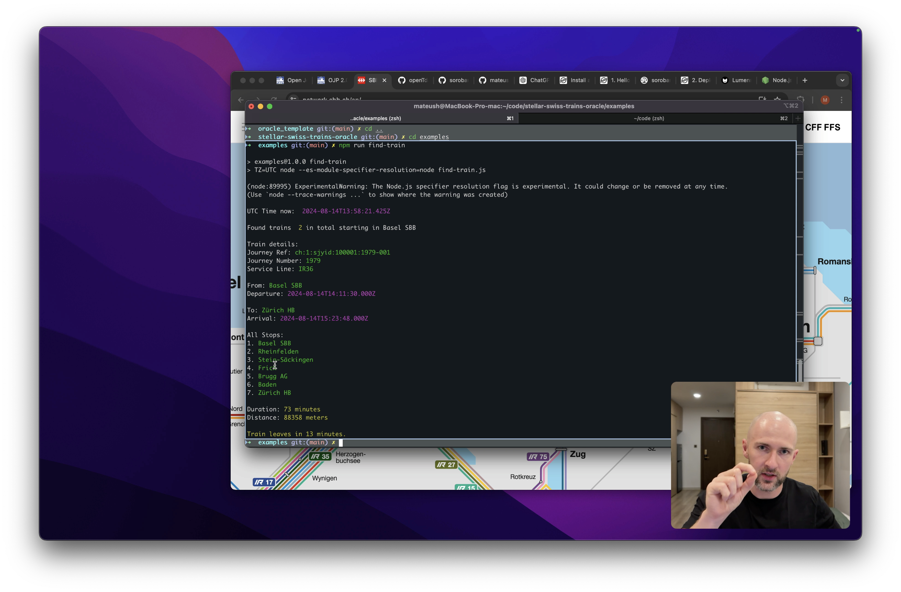
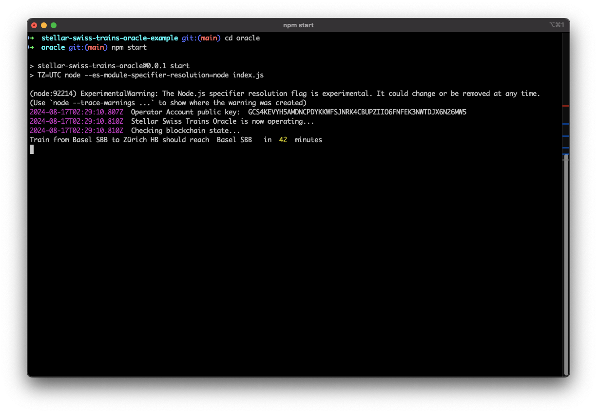

# Swiss Train Tracker on Stellar Blockchain

Learn how to store real-world data on the blockchain by tracking the journeys of the [IR36](https://network.sbb.ch/en/line/IR36) train from Basel to Zürich HB. The project provides transparent, immutable, and decentralized record of the train's journeys, offering real-time data that can be verified by anyone. This repository contains an example application from the [How To Build Oracles with Soroban](https://youtube.com/watch?v=mhUUQqo_dlg) screencast.

# Watch on YT

[](https://youtube.com/watch?v=mhUUQqo_dlg)

# Usage

To check the current journey details for the train IR36 on the blockchain, run the following command:

```bash
stellar contract invoke --id CDVCACHHWJJDBNJOJHPHZDKJV3PRFMT6HDM52AF3RBTW2LG3ERIOXNO2 --source <<YOUR ACCOUNT NAME>> --network testnet -- get_journey | jq
```

You need to setup Stellar CLI before using this command. To do so, just follow instructions in [docs](https://developers.stellar.org/docs/build/smart-contracts/getting-started/setup).

Result:

```json
{
  "current_stop": 1,
  "journey_ref": "63683a313a736a7969643a3130303030313a313937352d303031",
  "journey_status": 2,
  "stop_arrivals": [
    1723551060,
    1723551900,
    18446744073709551615,
    18446744073709551615,
    18446744073709551615,
    18446744073709551615,
    18446744073709551615
  ],
  "stop_refs": [
    8500010,
    8500301,
    8500320,
    8500305,
    8500309,
    8503504,
    8503000
  ],
  "stop_timetable": [
    1723551090000,
    1723551840000,
    1723552440000,
    1723552860000,
    1723553820000,
    1723554420000,
    1723555428000
  ]
}
```

# How to Run?

Before you start following this guide you must configure [Stellar CLI](https://developers.stellar.org/docs/build/smart-contracts/getting-started/setup).

## Deploy the contract

Run tests to ensure everything is set up correctly:

```bash
cargo test
```

You should see output similar to this:

```bash
   Compiling swiss-train-manager v0.0.1 (.../contracts/swiss_trains_manager)
    Finished `test` profile [unoptimized + debuginfo] target(s) in 3.65s
     Running unittests src/lib.rs (target/debug/deps/swiss_train_manager-8f83991ea2f22bb8)

running 4 tests
test test::test_initialize_contract ... ok
test test::test_get_journey ... ok
test test::test_schedule_journey ... ok
test test::test_check_in ... ok

test result: ok. 4 passed; 0 failed; 0 ignored; 0 measured; 0 filtered out; finished in 0.13s
```

### 1. Build the contract:

```rs
stellar contract build
```

### 3. Deploy the contract to the testnet:

```bash
stellar contract deploy --wasm target/wasm32-unknown-unknown/release/swiss_train_manager.wasm --source <<YOUR ACCOUNT NAME>> --network testnet
# CDVCACHHWJJDBNJOJHPHZDKJV3PRFMT6HDM52AF3RBTW2LG3ERIOXNO2
```
Congrats! You deployed you first smart contract!

### 4. Store contract ID in oracle/.env file:

```
echo "CONTRACT_ID=CDVCACHHWJJDBNJOJHPHZDKJV3PRFMT6HDM52AF3RBTW2LG3ERIOXNO2" >> ./oracle/.env
```

### 5. Create Operator (oracle's) account
```
stellar keys generate --global operator --network testnet
```

### 6. Export Operator wallet keys

```bash
echo "OPERATOR_PRIVATE_KEY=$(stellar keys show operator)" >> ./oracle/.env
```

### 7. Nominate contract Operator

Retrieve Operator public address

```bash
stellar keys address operator
// GCS4KEVYH5AMDNCPDYKKWFSJNRK4CBUPZIIO6FNFEK3NWTDJX6N26MW5
```

Call the `init` method reponsible of setting contract's operator

```bash
stellar contract invoke --id CDVCACHHWJJDBNJOJHPHZDKJV3PRFMT6HDM52AF3RBTW2LG3ERIOXNO2 --source mateusz --network testnet -- init --operator <<OPERATOR ACCOUNT PUBLIC KEY>>
```

### 8. Try to invoke contract

```bash
stellar contract invoke --id CDVCACHHWJJDBNJOJHPHZDKJV3PRFMT6HDM52AF3RBTW2LG3ERIOXNO2 --source operator --network testnet -- get_journey | jq
```

If you see output similar to this it means your contract is working:

```json
{
  "current_stop": 4294967295,
  "journey_ref": "63683a313a736a7969643a3130303030313a313937352d303031",
  "journey_status": 0,
  "stop_arrivals": [],
  "stop_refs": [],
  "stop_timetable": []
}
```

## Run Oracle

Once you have your smart contract setup, you can run Oracle and write first data to blockchain. 

### 1. Setup project

Navigate to the `oracle/` directory and install dependencies:

```bash
cd oracle
npm i
```

### 2. Start the Oracle:

```bash
npm start
```



# Acknowledgments
* [Open data platform mobility Switzerland](https://opentransportdata.swiss/en/) for making the train journey data available and providing [OJP-SDK](https://github.com/openTdataCH/ojp-js).
* [Stellar Development Foundation](https://stellar.org/) for providing the tools and infrastructure.
* This project competes in [Build Better on Stellar: Smart Contract Challenge](https://dev.to/challenges/stellar).